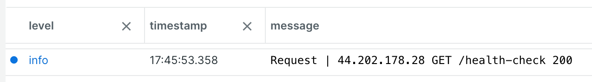
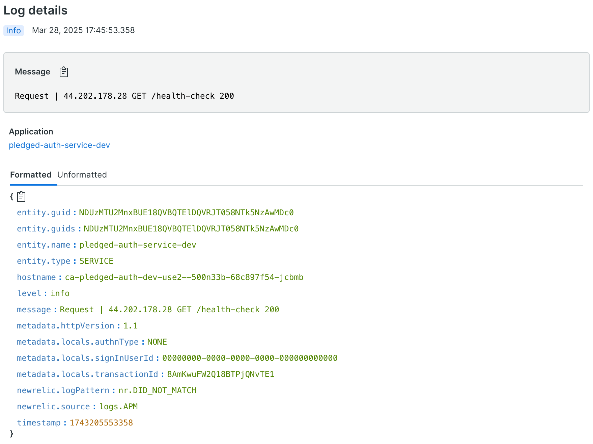

# winston-newrelic-agent-transport


A Winston transport using the New Relic agent. The transport requires your application to be using the New Relic agent.

The transport leverages the agent API to send log messages so it is not necessary to use an http client or set New Relic connection information for the transport. Once your agent is configured and connecting to New Relic, this transport should send logs.

The New Relic agent typically automatically forwards Winston logs to New Relic when using CommonJS. With CommonJS no additional transport should be needed. However, when using ECMAScript modules, the automatic forwarding of logs can with certain coding patterns not work. If the New Relic agent is not automatically forwarding your logs, this transport provides a solution.

Notable is that the transport allows you to exclude log messages that match configured characteristics. If there are certain types of log messages you wish to exclude from being sent to New Relic, the transport can help with that.

## Installation

```sh
npm install --save winston-newrelic-agent-transport
```

## Usage

```javascript
import { createLogger } from 'winston'
import NewrelicTransport from 'winston-newrelic-agent-transport'

const logger = createLogger({
  transports: [
    new NewrelicTransport({
      level: 'info'
    })
  ]
})

export default logger
```

### Options

#### level (optional)

The Winston logging level to use as the maximum level of messages that the transport will log.

#### rejectCriteria (optional)

The rejectCriteria option allows you to specify an array of regexes that will be matched against either the Winston info object or log message to determine whether or not a log message should be rejected and not logged to New Relic.

If a log message matches any of the regexes, it will be rejected and not logged to New Relic.

Each item in the array is an object with the following fields:

`property`
: The name of the property in the Winston info object whose value should be checked or use `null` to indicate that the log message should be checked.

`regex`
: The regex to match against the value indicated by `property`.

The Winston info object includes the data you added using the logger `meta` parameter. For example, if you added a log entry with commands like the following, fields added to the locals object could be retrieved at `metadata.locals`.

```javascript
  const meta = {
    locals: res.locals,
  }

  logger.info(message, meta)
```

A hosting provider was sending many health checks to our site and we wished to exclude them from the New Relic logs. We used the following rejectCriteria to not log these health checks to New Relic:

```javascript
  new NewrelicTransport({
    level: 'info',
    rejectCriteria: [
      {
        property: 'metadata.headers.user-agent',
        regex: '^ELB-HealthChecker'
      }
    ]
  })
```

## Notes

I found that since this transport is using the agent recordLogEvent method to log events, the agent adds the New Relic context to the log. It is not necessary to add `application_logging.local_decorating.enabled: true` to your New Relic config. Adding that entry did not change the context behavior at all. It is also not necessary to use `@newrelic/winston-enricher`.

To get the metadata information showing at New Relic, I found it is important to put the log entry in JSON format.

A caution is that New Relic starts to show the entry JSON instead of the message if the log entry is too large. When this happens, the entry is also not parsed into its separate fields. The following example shows how to pick the exact fields to send to New Relic to reduce the size of the entry. If I include all of my metadata, the log entry is too large for New Relic. So, I only include the locals object. The locals object is used to record fields like account id that are useful to query against.

Here is an example of logger code using this transport:

```javascript
import { jsonc } from 'jsonc'
import { format } from 'logform'
import winston from 'winston'
import NewrelicTransport from 'winston-newrelic-agent-transport'

import config from '../config.js'

const LOG_LEVEL_DEBUG = 'debug'
const LOG_LEVEL_INFO = 'info'

// New Relic does not like log entries that are too large. Thus, keep fields to a minimum.
const newrelicFormat = format((info) => {
  const nrFormat: {
    level: string
    timestamp: string
    message: string
    metadata: {
      locals?: object
      httpVersion?: string
    }
  } = {
    level: info.level,
    timestamp: typeof info.timestamp === 'string' ? info.timestamp : '',
    message: typeof info.message === 'string' ? info.message : '',
    metadata: {}
  }

  if ('metadata' in info && typeof info.metadata === 'object' && info.metadata !== null) {
    if ('locals' in info.metadata && typeof info.metadata.locals === 'object' && info.metadata.locals !== null) {
      nrFormat.metadata.locals = info.metadata.locals
    }
    if ('httpVersion' in info.metadata && typeof info.metadata.httpVersion === 'string') {
      nrFormat.metadata.httpVersion = info.metadata.httpVersion
    }
  }

  return nrFormat
})()

let options: winston.LoggerOptions
if (config.get('runningLocal')) {
  options = {
    transports: [
      new winston.transports.Console({
        level: LOG_LEVEL_DEBUG,
        format: format.combine(
          format.timestamp({ format: 'YYYY-MM-DD HH:mm:ss.SSS' }),
          format.metadata({ key: 'metadata', fillExcept: ['level', 'message', 'timestamp'] }),
          format.align(),
          format.printf((info) => {
            const timestamp = typeof info.timestamp === 'string' ? info.timestamp : ''
            const message = typeof info.message === 'string' ? info.message : ''
            const metadata = info.metadata as object
            return `${timestamp} ${info.level}: ${message}${(Object.entries(metadata).length > 0) ? ' | ' + jsonc.stringify(info.metadata) : ''}`
          })
        )
      })
    ]
  }
} else {
  options = {
    transports: [
      new winston.transports.Console({
        level: LOG_LEVEL_INFO,
        format: format.combine(
          format.timestamp({ format: 'YYYY-MM-DD HH:mm:ss.SSS' }),
          format.metadata({ key: 'metadata', fillExcept: ['level', 'message', 'timestamp'] }),
          format.align(),
          format.printf((info) => {
            const timestamp = typeof info.timestamp === 'string' ? info.timestamp : ''
            const message = typeof info.message === 'string' ? info.message : ''
            const metadata = info.metadata as object
            return `${timestamp} ${info.level}: ${message}${(Object.entries(metadata).length > 0) ? ' | ' + jsonc.stringify(info.metadata) : ''}`
          })
        )
      }),
      new NewrelicTransport({
        level: LOG_LEVEL_INFO,
        rejectCriteria: [
          {
            property: 'metadata.headers.user-agent',
            regex: '^ELB-HealthChecker'
          }
        ],
        format: format.combine(
          format.timestamp(),
          format.metadata({ key: 'metadata', fillExcept: ['level', 'message', 'timestamp'] }),
          newrelicFormat,
          format.json()
        )
      })
    ]
  }
}

const logger = winston.createLogger(options)

export default logger
```

The example logger code is used to produce a lean log entry in the New Relic Logs list that looks like this:
</br>
</br>


Clicking on the log entry displays Log details that look like this:
</br>
</br>


The Log details include the custom fields added to the locals object. Notable is those custom fields can be used in NRQL queries.

The transport code uses the [JavaScript Standard Style](https://standardjs.com) and may be checked with `npm run lint`.
